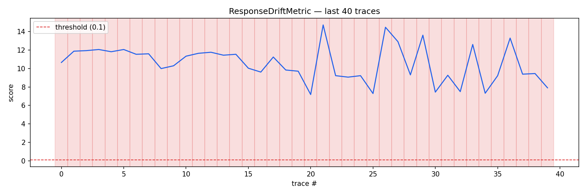
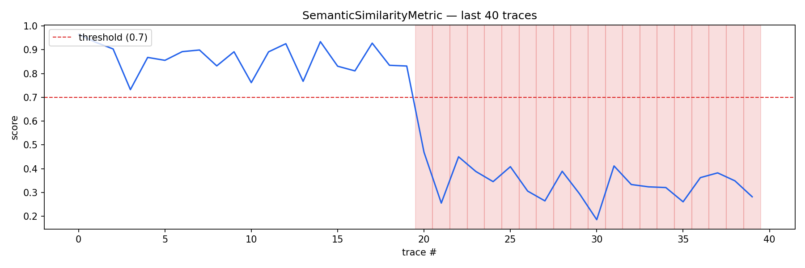
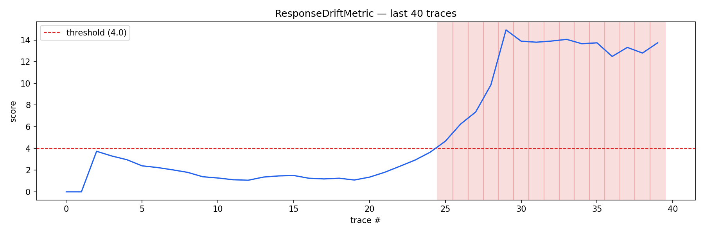
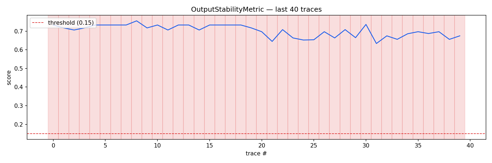
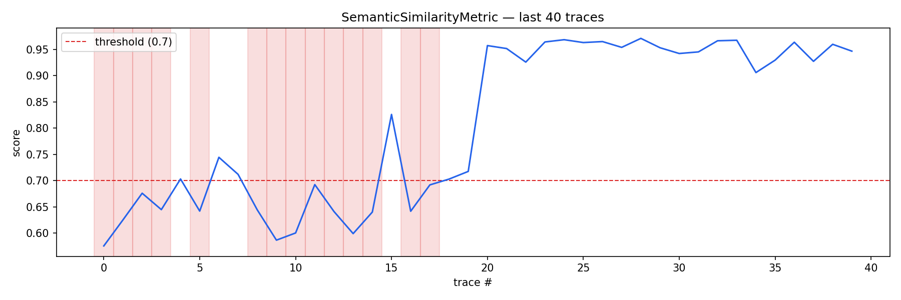
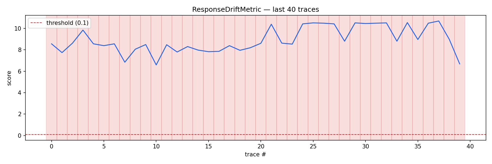

# spaniq

[](https://github.com/furyfist/spaniq/actions)
[](LICENSE)
[](https://www.python.org/downloads/)

Deterministic LLM evaluation and production monitoring without LLM-as-judge. Zero API cost. Fully reproducible scores.

1,000 test cases × 3 metrics → **$0.00** and **4 seconds** instead of **$34.20** and **9,000 API calls**.

## Install

```bash
pip install spaniq

# optional: Langfuse trace ingestion
pip install spaniq[langfuse]

# optional: Groq-based baseline collection and demos
pip install spaniq[groq]
```

## V1 — Offline Evaluation

### Quickstart

```python
from spaniq import LLMTestCase, evaluate
from spaniq.metrics import ResponseDriftMetric, SemanticSimilarityMetric

tc = LLMTestCase(
    input="what is your refund policy?",
    actual_output="we offer a 30-day money back guarantee",
    baseline_outputs=[
        "we offer 30-day refunds on all purchases",
        "refunds are available within 30 days of purchase",
        "you can return any item within 30 days for a full refund",
    ],
)

result = evaluate([tc], [ResponseDriftMetric(), SemanticSimilarityMetric(threshold=0.6)])
```

Output:
```
 spaniq run complete
 1 test cases × 2 metrics
 spaniq cost:     $0.00 (0 API calls)
 LLM-judge equiv: ~$0.01 (6 calls)
 duration:        4.21s
 passed:          1/1
 failed:          0/1
```

### pytest Integration

```python
from spaniq import LLMTestCase, assert_eval
from spaniq.metrics import ResponseDriftMetric, SemanticSimilarityMetric

def test_refund_response():
    tc = LLMTestCase(
        input="refund policy?",
        actual_output="30-day refund available",
        baseline_outputs=["we offer 30-day refunds", "refunds within 30 days"],
    )
    assert_eval(tc, [ResponseDriftMetric(), SemanticSimilarityMetric(threshold=0.6)])
```

Run with:
```bash
spaniq test run tests/
```

## V2 — Production Monitoring

V2 adds continuous monitoring of live LLM outputs against stored baselines. Detects prompt injection, model swaps, and RAG breakage in real-time at $0/trace.

### 10-line example

```python
from spaniq.monitor import BaselineStore, Monitor
from spaniq.monitor.collectors.file import FileCollector

# 1. collect a baseline (once)
store = BaselineStore()
store.create(
    name="refund-v1",
    prompt="what is your refund policy?",
    outputs=["we offer 30-day refunds"] * 20,
)

# 2. run the monitor against your trace file
monitor = Monitor(
    baseline_name="refund-v1",
    collector=FileCollector("traces.jsonl"),
    alert_after=3,
)
report = monitor.run()
print(f"{report.total_traces} traces, {report.alerts_fired} alerts")
```

### Baseline collection CLI

```bash
# collect 50 baseline outputs from Groq
spaniq baseline collect --name refund-v1 --prompt "what is your refund policy?" --n 50

# list all baselines
spaniq baseline list

# inspect a baseline
spaniq baseline show refund-v1
```

### Monitor CLI

```bash
# run monitor against a JSONL trace file
spaniq monitor run --baseline refund-v1 --source file --path traces.jsonl

# run monitor polling Langfuse every 30s
spaniq monitor run --baseline refund-v1 --source langfuse --poll-interval 30

# custom alert threshold and metrics
spaniq monitor run --baseline refund-v1 --source file --path traces.jsonl \
  --alert-after 5 --metrics ResponseDrift,SemanticSimilarity
```

JSONL trace format:
```json
{"input": "what is your refund policy?", "output": "we offer 30-day refunds", "timestamp": "2024-01-01T00:00:00+00:00"}
```

### Timeline CLI

```bash
# terminal sparkline of recent scores
spaniq timeline show --metric ResponseDriftMetric --last 50

# export PNG chart
spaniq timeline export --metric ResponseDriftMetric --last 200 --output drift.png

# aggregate statistics
spaniq timeline summary --metric ResponseDriftMetric --last 200
```

### Replay Demos

Three reproducible demos that show the monitoring in action. Run offline with pre-generated fixtures (no API key needed):

```bash
# demo 1: prompt injection → pirate persona → vocabulary drift detected
spaniq demo prompt-injection --offline

# demo 2: model swap 70B → 8B → structural change detected
spaniq demo model-swap --offline

# demo 3: RAG retrieval failure → hedging words → semantic drift detected
spaniq demo rag-breakage --offline

# run all three
spaniq demo run-all --offline
```

With `GROQ_API_KEY` set, omit `--offline` to generate fresh outputs from the Groq free tier.

---

## What the demos actually show

This section walks through what spanIQ caught in each demo — no LLM involved, just math on top of your traces.

Each demo runs 40 traces: 20 normal, then 20 where something breaks. The charts show how the scores evolve trace-by-trace. The red dashed line is the alert threshold. Red shading means an alert fired.

---

### Demo 1 — Prompt Injection

**What happened:** A support agent's system prompt was hijacked and replaced with a pirate persona. The agent starts responding with pirate vocabulary instead of normal support language.

**Why this is hard to catch manually:** The LLM still returns coherent, grammatical text. It just sounds completely different. A human reviewer looking at individual traces might not notice the shift unless they're comparing against what "normal" looks like.

**What spanIQ caught:**

Two independent metrics, both triggered at trace 20.

**ResponseDriftMetric (PSI — vocabulary distribution)**

PSI measures how much the word frequency distribution shifted compared to baseline. Scores below the threshold (8.0) are normal. At trace 20, as the injected traces start coming in, PSI climbs from ~7 to 23 and keeps going. The model's vocabulary has completely changed.



**SemanticSimilarityMetric (cosine similarity via MiniLM)**

Cosine similarity measures whether the meaning of the response is still close to baseline. Pre-injection: scores hover 0.75–0.93. Post-injection: they collapse to 0.20–0.45. The agent is saying semantically different things.



**Result:** 72 alerts across 40 traces. Pass rate dropped to 50% on ResponseDrift, 50% on Semantic, and 5% on OutputStability. Two independent detectors caught the same event — neither needed to know what "pirate" means.

---

### Demo 2 — Silent Model Swap

**What happened:** The team swapped the backend model from a 70B to an 8B without updating monitoring. The smaller model produces shorter, blunter, less structured responses to the same prompts.

**Why this is hard to catch manually:** The outputs are still on-topic and grammatically correct. No obvious errors. Just... subtly different. This kind of silent regression is exactly what causes support quality to degrade over weeks without anyone noticing.

**What spanIQ caught:**

**ResponseDriftMetric (PSI)**

For the first 20 traces (70B), PSI holds flat below 2.0 — the model is consistent. At trace 24, the 8B model starts responding. PSI climbs steadily through the threshold (4.0) and plateaus around 14. The vocabulary distribution shifted and stayed shifted.



**OutputStabilityMetric (JS divergence on structural features)**

This metric tracks structural features — response length, sentence count, formatting patterns. The smaller model produces structurally different outputs: shorter, less detailed. The score climbs from ~0.15 to 0.60+ after the swap and never comes back down.



**Result:** 43 alerts across 40 traces. The swap was caught at trace 24. No one had to manually compare 70B vs 8B outputs.

---

### Demo 3 — RAG Retrieval Failure

**What happened:** The retrieval system broke at trace 20. The LLM stopped receiving relevant context and started generating hedging responses ("I'm not sure", "it depends", "I don't have enough information") instead of direct, grounded answers.

**Why this is hard to catch manually:** The LLM doesn't error. It doesn't hallucinate wildly. It just becomes vague and uncertain — which looks plausible until you notice it's happening on every single query. By that time, users have already had a bad experience for hours.

**What spanIQ caught:**

**SemanticSimilarityMetric**

When retrieval works, every response is semantically close to the baseline: scores hold at 0.93–0.96. At trace 20, retrieval fails. Scores drop immediately to 0.60–0.70 and never recover. The LLM is saying different things because it has nothing to say.



**ResponseDriftMetric (PSI)**

PSI tells the same story from the vocabulary angle. Hedging words ("perhaps", "I'm not sure", "it depends") weren't in the baseline distribution. PSI sits near 0 for traces 0–19, then climbs sharply past 20 and plateaus around 22.



**Result:** 58 alerts across 40 traces. Retrieval failure detected at trace 20 — the exact moment it happened.

---

### Summary

| Demo | Failure mode | Detected at | Alerts | Cost |
|---|---|---|---|---|
| Prompt injection | System prompt hijack | Trace 20 | 72 | $0.00 |
| Model swap | 70B → 8B backend change | Trace 24 | 43 | $0.00 |
| RAG breakage | Retrieval context lost | Trace 20 | 58 | $0.00 |

Six charts. Three failure modes. Zero API calls. The signal comes from comparing distributions, not from asking another LLM whether something looks wrong.

## Metrics

| Metric | Method | Detects | Requires |
|---|---|---|---|
| `ResponseDriftMetric` | PSI on word distributions | Vocabulary/style drift | `baseline_outputs` |
| `SemanticSimilarityMetric` | Cosine similarity via MiniLM | Semantic drift | `expected_output` or `baseline_outputs` |
| `OutputStabilityMetric` | JS divergence on structural features | Length/structure changes | `baseline_outputs` |
| `ConsistencyMetric` | KS test on embedding distances | Erratic output patterns | `baseline_outputs` (≥5) |

## Cost Comparison

| Tool | 1,000 cases × 3 metrics | Deterministic | Offline |
|---|---|---|---|
| deepeval / ragas | ~$34/run | No | No |
| **spaniq** | **$0.00** | **Yes** | **Yes** |

## Architecture

```
V1 (eval):
  LLMTestCase → metrics → evaluate() → EvalResult

V2 (monitoring, built on V1):
  Trace Source → Collector → LLMTestCase → Monitor → metrics → TimelineStore → AlertEngine
       ↑                          ↑
  langfuse API              BaselineStore
  JSONL file                (baseline_outputs)
  direct SDK
```

## When spanIQ Is Not the Right Tool

- Subjective quality judgment ("is this helpful?") — needs LLM
- Factual accuracy / hallucination detection — needs LLM
- Safety and toxicity — needs a safety model
- Zero-shot eval with no baselines — nothing to compare against

See [docs/WHY.md](docs/WHY.md) for the full argument.

## Migration from deepeval

See [docs/DEEPEVAL_MIGRATION.md](docs/DEEPEVAL_MIGRATION.md) for a side-by-side mapping.

## Contributing

```bash
git clone https://github.com/furyfist/spaniq
cd spaniq
python -m venv .venv && .venv/Scripts/activate
pip install -e ".[dev]"
pytest
ruff check .
```

## License

Apache 2.0
